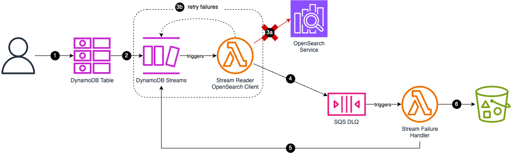

## Stream data from DynamoDB into OpenSearch
### Why?
DynamoDB is serverless document storage fully managed by AWS. Unlike the traditional
SQL databases, DynamoDB requires a strong understanding of current and the future application's
access patterns - making it inefficient when handling more complex queries. This is where
OpenSearch comes in. OpenSearch offers a set of neat search features and filters, making it easy 
to extend our API to offer more sophisticated way to query our data.

### Ok, by why not use [DynamoDB zero-ETL integration with OpenSearch](https://docs.aws.amazon.com/amazondynamodb/latest/developerguide/OpenSearchIngestionForDynamoDB.html)?
Under the hood, zero-ETL solution utilizes DynamoDB export to S3 feature, and it takes a bit 
of time to synchronize the changes between DynamoDB source table and OpenSearch cluster.
Also, personally I don't have so much of an experience working with OpenSearch, let alone creating 
seamless ingestion pipelines. I thought it'd be nice to build a custom solution first, thus giving 
me a chance to work with a bare OpenSearch mechanics.

### Some considerations and limitations
- we're assuming that the entire object is stored in a single DynamoDB record - thus our object's 
size mustn't exceed 400 KB (DynamoDB item size limit)
- we can have up to 2 processes which can read from the same stream's shard at the same time - 
having more can result in throttling - <u>if you use Global Table, then you can have ONLY ONE 
stream reader</u>
- the code of Lambda consumer for DynamoDB Streams should be idempotent

### Basic idea
#### 1st iteration - Architecture

1. Put item into DynamoDB table
2. Capture record modifications with DynamoDB Streams
3. When the change is detected, trigger Lambda function. The data will be read in batches, so we 
can save on the invocations
4. Send data to OpenSearch service

#### 1st iteration - Error handling

1. Put item into DynamoDB table
2. Capture record modifications with DynamoDB Streams
3. When the change is detected, trigger Lambda function  \
a) Try saving the data in the OpenSearch Service  \
b) If some of the records in the batch cannot be processed, then retry - Lambda will be invoked once again,
but this time, only the previously failed records will be processed
4. If we still cannot process the records, send the message to failure destination - SQS dead letter queue
5. The failure handler reads the records from the DynamoDB Stream and...
6. ...saves them to some durable storage (e.g. S3)

#### Caveats
- a failed-event Lambda destination message contains only invocation data - the actual items aren't included
  ([source](https://docs.aws.amazon.com/lambda/latest/dg/with-ddb.html#services-dynamodb-errors))
- shard iterators expire after 15 minutes, so we need to process the failed records within this time range
- given the shard iterator, we most likely also retrieve the records which were successfully processed
- the first lambda reads the data from the Stream AND pushes the records into OpenSearch Service -
generally it's good practice for your Lambda to do one specific task

These caveats will be addressed in the next iteration of the architecture.

#### 2nd iteration - Architecture
_tbc_
#### 2nd iteration - Error handling
_tbc_